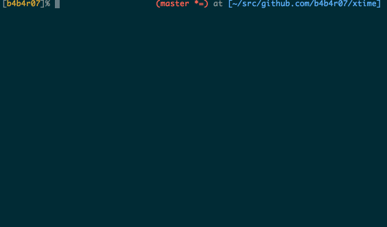

# cdinterface

The next generation of change directory with peco

## Description

`cd` command is one of the frequently used commands. Nevertheless, it is very inconvenient. `cd` interpret path (`/home/john/dir1`, `../../dir2`) only. `cd` does not accept the directory name (`dir3`). The new `cd` command I have to hack interpret this. Take the log every time that you want to move, and to complement the directory path based on that log.

***DEMO:***

## Features

1. Replace the existing `cd` command.
2. It is possible to go to the directory where you have visited in the past.
3. If a directory name is duplicated, it can be selected interactively with [peco](https://github.com/peco/peco).
4. If the argument is not given, it is possible to select the directory where you want to go.
5. Combine with [`ghq`](https://github.com/motemen/ghq) and [`peco`](https://github.com/peco/peco).
6. Work on Bash ans Zsh

## Requirements

- [peco/peco](https://github.com/peco/peco)
- ([motemen/ghq](https://github.com/motemen/ghq))

## Usage

	$ cd <directroy>

## Installation

	$ git clone https://github.com/b4b4r07/cdinterface
	$ source cdinterface/cdinterface.sh

## License

[MIT](https://raw.githubusercontent.com/b4b4r07/dotfiles/master/doc/LICENSE-MIT.txt)

## Author

[BABAROT](http://tellme.tokyo) a.k.a. b4b4r07
